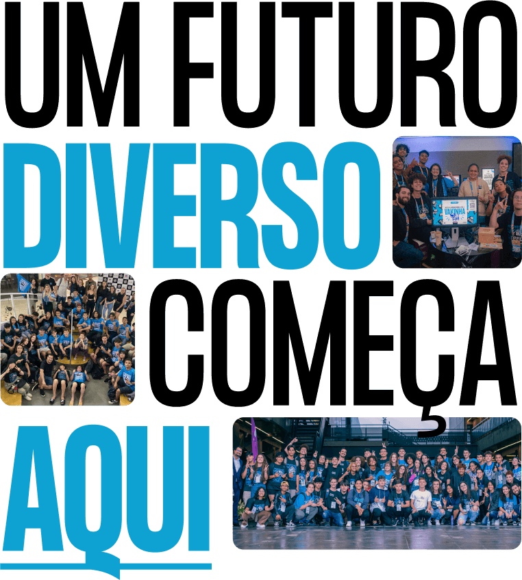

# Site PAQ

    

---

## Seja muito bem vindo ao repositório do site do PAQ

### O que é o PAQ?

O PAQ é uma organização que, desde 2018, atua diretamente na região metropolitana de Florianópolis e nossa missão é conectar a juventude de periferia com o conhecimento e as oportunidades do mundo tech.

### Como contribuir para o projeto?

Todos são bem vindos para contribuir com o nosso projeto, atualmente a gente tem um backlog definido nos projetos do Github, você pode começar dando uma olhada por lá e ver se tem alguma tarefa que faz sentido para você.

Caso tenha mais dúvidas sobre como rodar o projeto ou sobre as boas práticas de contribuição, você pode dar uma olhada nas seguintes documentações:

- [Como rodar o projeto](./docs/como_rodar.md)
- [Boas práticas de contribuição]()

